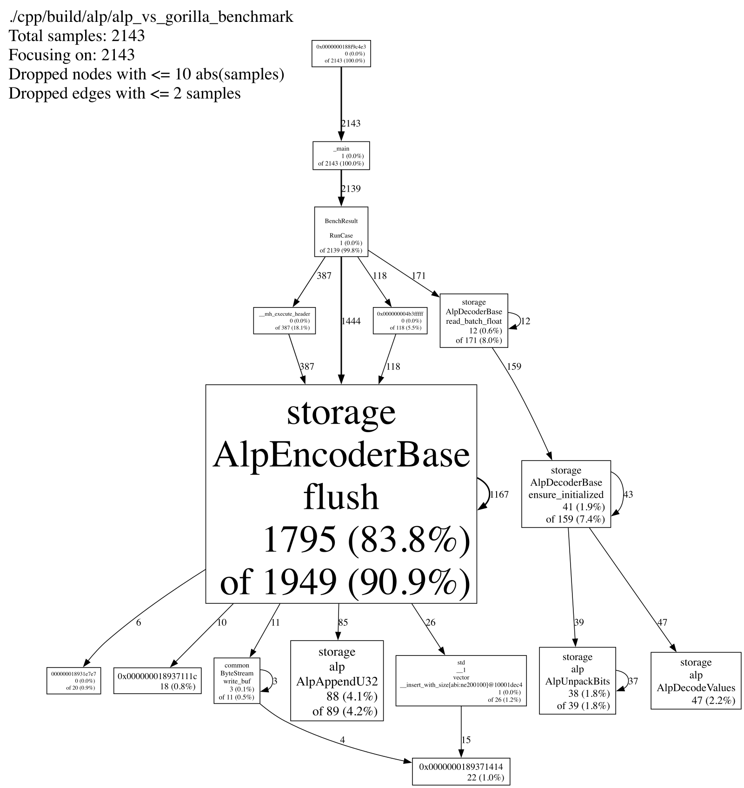
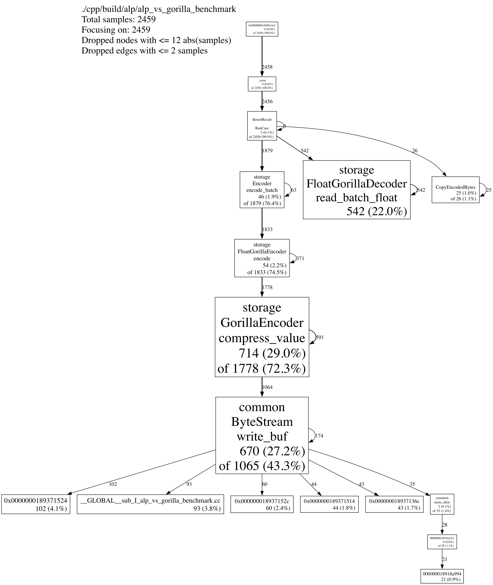

<!--

    Licensed to the Apache Software Foundation (ASF) under one
    or more contributor license agreements.  See the NOTICE file
    distributed with this work for additional information
    regarding copyright ownership.  The ASF licenses this file
    to you under the Apache License, Version 2.0 (the
    "License"); you may not use this file except in compliance
    with the License.  You may obtain a copy of the License at

        http://www.apache.org/licenses/LICENSE-2.0

    Unless required by applicable law or agreed to in writing,
    software distributed under the License is distributed on an
    "AS IS" BASIS, WITHOUT WARRANTIES OR CONDITIONS OF ANY
    KIND, either express or implied.  See the License for the
    specific language governing permissions and limitations
    under the License.

-->

# ALP Profiling Analysis

This note explains why the ALP codec still loses to Gorilla in some cases
even though the value kernels are SIMD-accelerated. The profiles were collected
with gperftools on the FLOAT decimal benchmark case.

## Profile Setup

```bash
CPUPROFILE=/tmp/alp_float.prof \
CPUPROFILE_FREQUENCY=1000 \
DYLD_INSERT_LIBRARIES=/opt/homebrew/lib/libprofiler.dylib \
./cpp/build/alp/alp_vs_gorilla_benchmark 500 ALP FLOAT decimal

/opt/homebrew/bin/pprof --svg \
  ./cpp/build/alp/alp_vs_gorilla_benchmark \
  /tmp/alp_float.prof > /tmp/alp_float.svg
```

The same command was repeated with `GORILLA` for comparison.

## ALP FLOAT Decimal



Flat profile:

| Function | Flat | Cumulative |
| --- | ---: | ---: |
| `storage::AlpEncoderBase::flush` | 83.8% | 90.9% |
| `storage::alp::AlpAppendU32` | 4.1% | 4.2% |
| `storage::AlpDecoderBase::ensure_initialized` | 1.9% | 7.4% |
| `storage::alp::AlpUnpackBits` | 1.8% | 1.8% |
| `storage::alp::AlpDecodeValues` | 2.2% | 2.2% |
| `storage::AlpDecoderBase::read_batch_float` | 0.6% | 8.0% |

The encode path dominates. Decode is already a small fraction of total time.

## Gorilla FLOAT Decimal



Flat profile:

| Function | Flat | Cumulative |
| --- | ---: | ---: |
| `storage::GorillaEncoder::compress_value` | 29.0% | 72.3% |
| `common::ByteStream::write_buf` | 27.2% | 43.3% |
| `storage::FloatGorillaDecoder::read_batch_float` | 22.0% | 22.0% |
| `storage::FloatGorillaEncoder::encode` | 2.2% | 74.5% |
| `storage::Encoder::encode_batch` | 1.9% | 76.4% |

Gorilla spends most of its time in its scalar bit writer and in the ByteStream
write path. Its encode is not SIMD either; it is simply a very efficient
scalar bit stream for the FLOAT decimal pattern.

## Per-Block Breakdown

A separate microbenchmark measured one 1024-value block with the same decimal
pattern:

| Stage | FLOAT (ms/block) | DOUBLE (ms/block) |
| --- | ---: | ---: |
| `AlpChooseFactorExponent` | 0.004 | 0.009 |
| `AlpEncodeValues` (SIMD) | 0.001 | 0.001 |
| `AlpPackBits` (scalar) | 0.009 | 0.006 |
| `AlpEncodePage` total | 0.012 | 0.017 |

The SIMD value kernel is only about 6-8% of ALP encode time. The rest is the
scalar exponent/factor search and the scalar bit-packing loop.

## Why ALP Still Loses

1. **Encode is not end-to-end SIMD.**
   The SIMD path covers `value -> integer` conversion and exception detection,
   but `AlpPackBits` is scalar and, for FLOAT, accounts for roughly 75% of the
   encode time. That is why ALP FLOAT encode is slower than Gorilla even though
   the value kernel is SIMD.

2. **The exponent/factor search is scalar.**
   `AlpChooseFactorExponent` evaluates candidate `(factor, exponent)` pairs on
   sampled values. It is about 33% of FLOAT encode and about 53% of DOUBLE
   encode. For DOUBLE, this is the largest single encode cost.

3. **Non-decimal data falls back to PLAIN.**
   Smooth/random/constant data often has too many exceptions for ALP to win.
   The encoder then emits a PLAIN block. In that case SIMD cannot help because
   the data is not ALP-encoded at all; Gorilla is usually the better codec for
   those columns.

4. **Gorilla has a dedicated constant path.**
   Gorilla compresses constant blocks extremely well and decodes them very
   quickly. ALP intentionally does not special-case that pattern, so Gorilla
   wins the constant rows of the benchmark.

5. **The benchmark is on Apple Silicon.**
   SIMDe maps the AVX2-style kernels to NEON here. On x86, a native `-mavx2`
   translation unit and runtime dispatch are still required to get the AVX2
   peak; without those flags SIMDe may emulated AVX2 with SSE2.

## Next Optimizations

1. **SIMD bit packing.**
   Pack four values at a time with the same 64-bit-window layout used by the
   SIMD unpack kernel. This directly targets the largest FLOAT encode cost.

2. **SIMD or cheaper exponent/factor selection.**
   Evaluate the candidate pairs on the 32-value sample with SIMD, or reduce the
   candidate set with an early-exit estimate. This targets the DOUBLE encode
   cost.

3. **Remove per-block allocations.**
   Reuse scratch vectors for `encoded`, `adjusted`, `bitmap`, and `body`
   instead of constructing them per block. Decode the final values directly
   into the caller's output buffer rather than an intermediate `values_`
   vector.

4. **Adaptive codec selection.**
   Choose Gorilla for constant/high-entropy columns and ALP for decimal-like
   columns. This avoids the PLAIN fallback cases where Gorilla is better.

5. **Native x86 dispatch.**
   Add an AVX2 object library and CPU detection so x86 users get native AVX2
   without `-march=native`, plus an optional AVX-512 path for DOUBLE.
